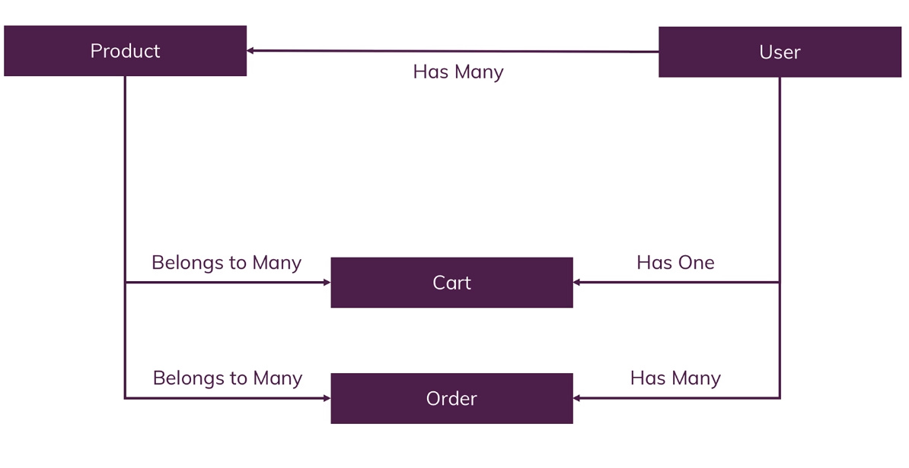

# Associations in Sequelize

Usually the Sequelize associations are defined in pairs. In summary:

-   To create a **One-To-One** relationship, the `hasOne` and `belongsTo` associations are used together;
-   To create a **One-To-Many** relationship, the `hasMany` and `belongsTo` associations are used together;
-   To create a **Many-To-Many** relationship, two `belongsToMany` calls are used together.

# One-To-One Relationships

## Philosophy

-   Let's say we have two models, `Foo` and `Bar`.
-   We want to establish a **One-To-One relationship** between Foo and Bar.
-   We know that in a relational database, this will be done by establishing a foreign key in one of the tables.
-   So in this case, a very relevant question is: in which table do we want this foreign key to be? In other words, do we want `Foo` to have a `barId` column, or should `Bar` have a `fooId` column instead?
    <br>

-   In principle, both options are a valid way to establish a **One-To-One relationship** between Foo and Bar.
-   However, when we say something like "_there is a One-To-One relationship between `Foo` and `Bar`_", it is unclear whether or not the relationship is mandatory or optional.
-   In other words, can a `Foo` exist without a `Bar`? Can a `Bar` exist without a `Foo`? The answers to these questions helps figuring out where we want the foreign key column to be.

## Goal

-   For the rest of this example, let's assume that we have two models, `Foo` and `Bar`. We want to setup a **One-To-One relationship** between them such that Bar gets a fooId column.

## Implementation

```
Foo.hasOne(Bar);
Bar.belongsTo(Foo);
```

-   Since no option was passed, Sequelize will infer what to do from the names of the models.
-   In this case, Sequelize knows that a `fooId` column must be added to `Bar`.
    <br>

-   This way, calling `Bar.sync()` after the above will yield the following SQL :
    ```
    CREATE TABLE IF NOT EXISTS "foos" (
      /* ... */
    );
    CREATE TABLE IF NOT EXISTS "bars" (
      /* ... */
      "fooId" INTEGER REFERENCES "foos" ("id") ON DELETE SET NULL ON UPDATE CASCADE
      /* ... */
    );
    ```

## Options

-   Various options can be passed as a second parameter of the association call.
-   `onDelete` and `onUpdate` for example :
    ```
    Foo.hasOne(Bar, {
      onDelete: 'RESTRICT',
      onUpdate: 'RESTRICT'
    });
    Bar.belongsTo(Foo);
    ```
-   The possible choices are `RESTRICT`, `CASCADE`, `NO ACTION`, `SET DEFAULT` and `SET NULL`.
-   **Default Values** are, `SET NULL` for `onDelete` and `CASCADE` for `onUpdate`.

### Customizing the foreign key

-   Both the `hasOne` and `belongsTo` calls shown above will infer that the foreign key to be created should be called `fooId`. To use a different name, such as `myFooId`:

    ```
    // Option 1
    Foo.hasOne(Bar, {
      foreignKey: 'myFooId'
    });
    Bar.belongsTo(Foo);

    // Option 2
    Foo.hasOne(Bar, {
      foreignKey: {
          name: 'myFooId'
      }
    });
    Bar.belongsTo(Foo);

    // Option 3
    Foo.hasOne(Bar);
    Bar.belongsTo(Foo, {
      foreignKey: 'myFooId'
    });

    // Option 4
    Foo.hasOne(Bar);
    Bar.belongsTo(Foo, {
      foreignKey: {
          name: 'myFooId'
      }
    });
    ```

-   To use `UUID` as the foreign key data type instead of the default (`INTEGER`), you can simply do :

    ```
    const { DataTypes } = require("Sequelize");

    Foo.hasOne(Bar, {
    foreignKey: {
        // name: 'myFooId'
        type: DataTypes.UUID
    }
    });
    Bar.belongsTo(Foo);
    ```

# One-To-Many Relationships

## Philosophy

-   One-To-Many associations are connecting one source with multiple targets, while all these targets are connected only with this single source.
-   For example, if one `Foo` has many `Bars` (and this way each Bar belongs to one `Foo`), then the only sensible implementation is to have a `fooId` column in the `Bar` table.

## Goal

-   In this example, we have the models `Team` and `Player`.
-   We want to tell Sequelize that there is a One-To-Many relationship between them, meaning that one Team has many Players, while each Player belongs to a single Team.

## Implementation

-   The main way to do this is as follows :

    ```
    Team.hasMany(Player);
    Player.belongsTo(Team);
    ```

-   For example, in PostgreSQL, the above setup will yield the following SQL upon sync():
    ```
    CREATE TABLE IF NOT EXISTS "Teams" (
      /* ... */
    );
    CREATE TABLE IF NOT EXISTS "Players" (
      /* ... */
      "TeamId" INTEGER REFERENCES "Teams" ("id") ON DELETE SET NULL ON UPDATE CASCADE,
      /* ... */
    );
    ```

## Options

Same as **One-To-One** Relationships.

# Many-To-Many Relationships

## Philosophy

-   Many-To-Many associations connect one source with multiple targets, while all these targets can in turn be connected to other sources beyond the first.
-   This cannot be represented by adding one foreign key to one of the tables.
-   Instead, the concept of a **Junction Model** is used.
-   This will be an extra model (and extra table in the database) which will have two foreign key columns and will keep track of the associations.
-   The `junction table` is also sometimes called `join table` or `through table`.

## Goal

-   For this example, we will consider the models `Movie` and `Actor`.
-   One actor may have participated in many movies, and one movie had many actors involved with its production.
-   The junction table that will keep track of the associations will be called `ActorMovies`, which will contain the foreign keys `movieId` and `actorId`.

## Implementation

-   The main way to do this in Sequelize is as follows :

    ```
    const Movie = sequelize.define('Movie', {name: DataTypes.STRING});
    const Actor = sequelize.define('Actor', {name: DataTypes.String});
    Movie.belongsToMany(Actor, {through: 'ActoMovies'});
    Movie.belongsToMany(Movies, {through: 'ActorMovies'});
    ```

-   Since a string was given in the `through` option of the `belongsToMany` call, Sequelize will automatically create the `ActorMovies` model which will act as the `junction model`. For example, in PostgreSQL:
    ```
    CREATE TABLE IF NOT EXISTS "ActorMovies" (
      "createdAt" TIMESTAMP WITH TIME ZONE NOT NULL,
      "updatedAt" TIMESTAMP WITH TIME ZONE NOT NULL,
      "MovieId" INTEGER REFERENCES "Movies" ("id") ON DELETE CASCADE ON UPDATE CASCADE,
      "ActorId" INTEGER REFERENCES "Actors" ("id") ON DELETE CASCADE ON UPDATE CASCADE,
      PRIMARY KEY ("MovieId","ActorId")
    );
    ```
-   Instead of a string, passing a model directly is also supported, and in that case the given model will be used as the junction model (and no model will be created automatically). For example:

    ```
    const Movie = sequelize.define('Movie', { name: DataTypes.STRING });
    const Actor = sequelize.define('Actor', { name: DataTypes.STRING });
    const ActorMovies = sequelize.define('ActorMovies', {
      MovieId: {
          type: DataTypes.INTEGER,
          references: {
              model: Movie, // 'Movies' would also work
          key: 'id'
          }
      },
      ActorId: {
          type: DataTypes.INTEGER,
          references: {
              model: Actor, // 'Actors' would also work
          key: 'id'
          }
      }
    });

    Movie.belongsToMany(Actor, { through: ActorMovies });
    Actor.belongsToMany(Movie, { through: ActorMovies });
    ```

## Options

-   Unlike One-To-One and One-To-Many relationships, the defaults for both `ON UPDATE` and `ON DELETE` are `CASCADE` for **Many-To-Many** relationships.
    <br>

-   `BelongsToMany` creates a unique key on `through` model. This unique key name can be overridden using `uniqueKey` option. To prevent creating this unique key, use the `unique: false` option.
    ```
    Project.belongsToMany(User, { through: UserProjects, uniqueKey: 'my_custom_unique' })
    ```

# Associations for Our Tables


